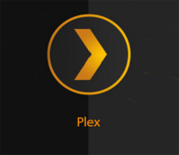

<?xml version="1.0" encoding="utf-8"?>
<html xmlns:MadCap="http://www.madcapsoftware.com/Schemas/MadCap.xsd" MadCap:onlyLocalStylesheets="False" MadCap:searchable="False" class="home-topic" style="mc-master-page: url('Resources/MasterPages/Home-Page.flmsp');">
    <head>
        <link href="" rel="stylesheet" type="text/css" />
    </head>
    <body class="home-topic">
        
&#160;

        

            

                

                    

                        

                            

                                
                            

                            

                                
What is Plex?

                            

                        

                    

                    

                        

                            

                                
                            

                            

                                
What is Plex Media Server?

                            

                        

                    

                

            

            

                <h1>Latest Updates</h1>
                

                    <a href="A-Introduction-Topics/3-Plex-Arcade.htm">Plex Arcade</a>
                

            

            

                <h1>Frequently Asked Questions</h1>
                <MadCap:dropDown>
                    <MadCap:dropDownHead>
                        <MadCap:dropDownHotspot>Question 1</MadCap:dropDownHotspot>
                    </MadCap:dropDownHead>
                    <MadCap:dropDownBody>
                        

                            <a href="C-Procedure-Topics/3-Accessing-Your-Plex-Account.htm">How do I view content using Plex?</a>
                        

                    </MadCap:dropDownBody>
                </MadCap:dropDown>
                <MadCap:dropDown>
                    <MadCap:dropDownHead>
                        <MadCap:dropDownHotspot>Question 2</MadCap:dropDownHotspot>
                    </MadCap:dropDownHead>
                    <MadCap:dropDownBody>
                        

                            <a href="C-Procedure-Topics/2-Remote-Access-Server-Sharing.htm">How do I stream my own content using Plex Media Server?</a>
                        

                    </MadCap:dropDownBody>
                </MadCap:dropDown>
                <MadCap:dropDown>
                    <MadCap:dropDownHead>
                        <MadCap:dropDownHotspot>Question 3</MadCap:dropDownHotspot>
                    </MadCap:dropDownHead>
                    <MadCap:dropDownBody>
                        

                            <a href="C-Procedure-Topics/3-Connect-Player-App-To-Plex.htm">How do I connect the Plex client app to a Plex Media Server?</a>
                        

                    </MadCap:dropDownBody>
                </MadCap:dropDown>
            

            

                <h1>Quick Links</h1>
                

                    

                        

                            
                        

                        

                            <a href="A-Introduction-Topics/2-What-Is-Plex-Media-Server.htm">PDF&#160;Guides</a>
                        

                    

                    

                        

                            
                        

                        

                            <a href="A-Introduction-Topics/2-What-Is-Plex-Media-Server.htm">Tutorial&#160;Videos</a>
                        

                    

                    

                        

                            
                        

                        

                            <a href="A-Introduction-Topics/2-What-Is-Plex-Media-Server.htm">Downloads</a>
                        

                    

                    

                        

                            
                        

                        

                            <a href="A-Introduction-Topics/2-What-Is-Plex-Media-Server.htm">Popular&#160;Topics</a>
                        

                    

                    

                        

                            
                        

                        

                            <a href="A-Introduction-Topics/2-What-Is-Plex-Media-Server.htm">User&#160;Forum</a>
                        

                    

                

            

        

    </body>
</html>